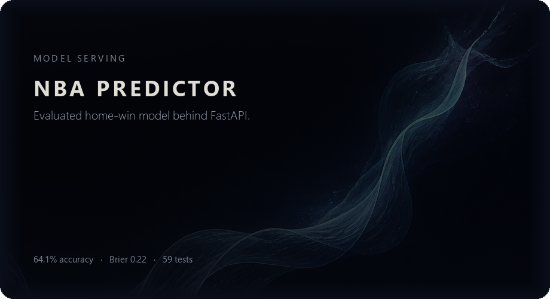
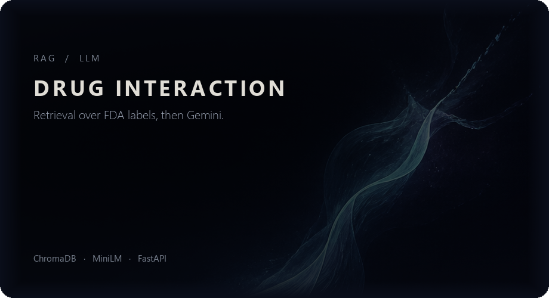
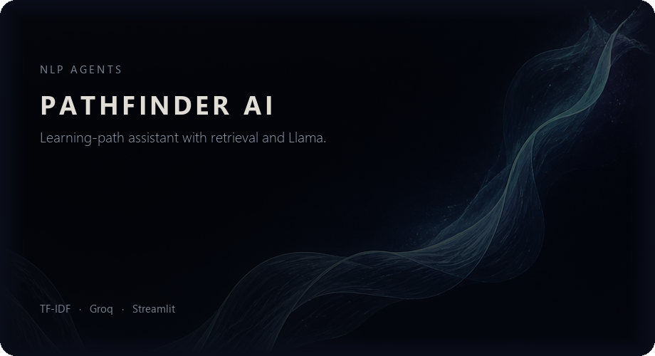
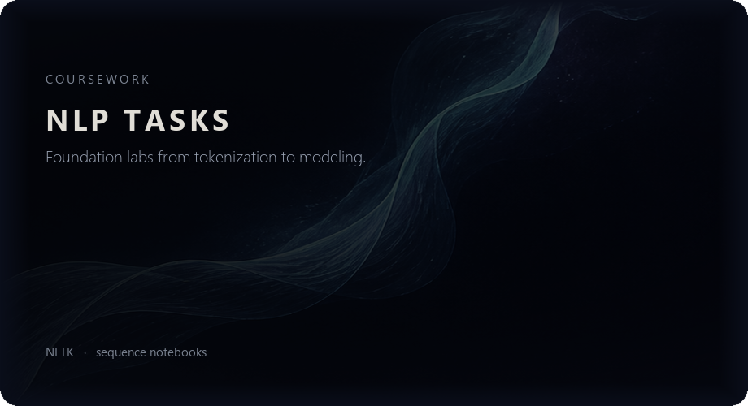
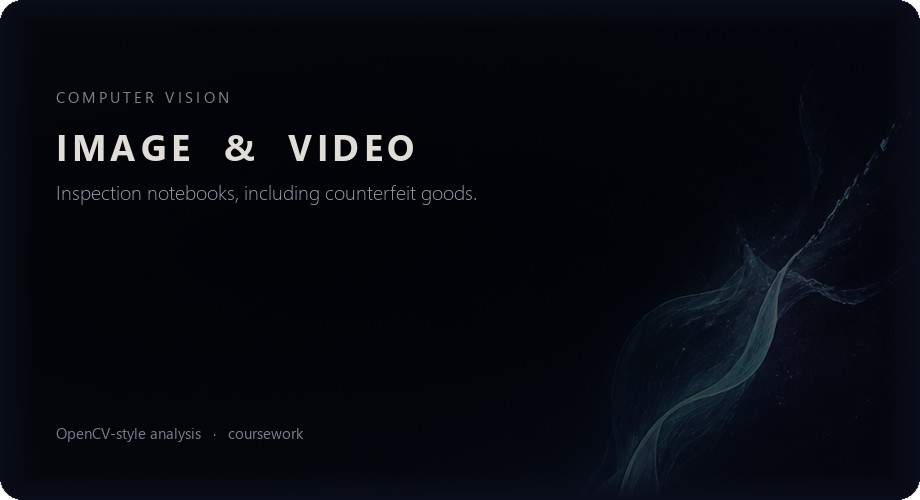
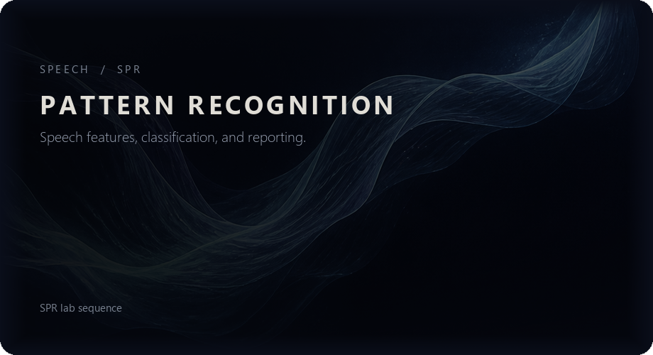
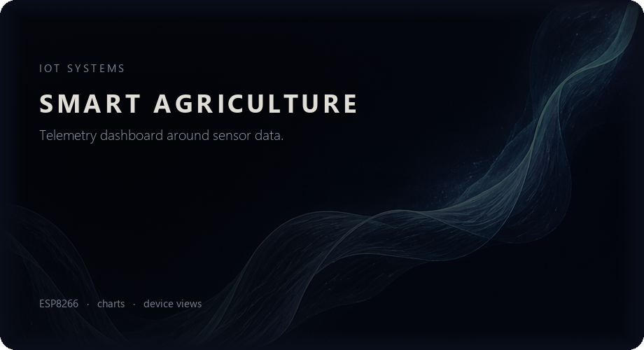

<!--
GitHub profile README.
To publish: create a public repo named Maria-James13/Maria-James13.
Put this file in it as README.md, and copy assets/github-banner.gif
plus assets/cards/.
-->

  

**AI/ML Engineer** building models that survive a real evaluation, not just a training-set score.

I work end to end: leakage-safe features, honest holdouts, baselines before boosting, and APIs that serve the frozen model.

[GitHub](https://github.com/Maria-James13) · [LinkedIn](https://www.linkedin.com/in/maria-james-36b063340/) · [Email](mailto:mariajameskolamkuzhy@gmail.com) · [Resume](https://drive.google.com/file/d/10SPtBxaV3IDBjUDJdA04dtIL5LGBsfz3/view?usp=drive_link)

---

## Professional introduction

I am an AI/ML engineer focused on **tabular prediction, NLP/LLM systems, and model serving**.

The pattern I care about is the same across domains: define the target so the model can learn, keep time and IDs out of the features, beat a strong baseline, then ship inference behind a typed API. On freight rates that meant predicting rate-per-mile instead of raw dollars, scoring on a future month, and freezing the model before hidden validation. On NBA games that meant a chronological season split, Brier score next to accuracy, and FastAPI with tests. On clinical text that meant a RAG pipeline over FDA labels, not a prompt with no retrieval.

I would rather report a slightly worse MAE from a conservative config than publish a lucky hyperparameter search.

---

## Core technical skills

| Area | What I actually do |
|---|---|
| **Supervised ML** | Gradient boosting (CatBoost, XGBoost, GBM), logistic regression, stacking / meta-learners |
| **Evaluation** | Temporal holdouts, leakage audits, MAE / RMSE / MAPE / MedAE, Brier / log loss, segment error (equipment, distance, class) |
| **Feature engineering** | Target transforms (RPM, log), rolling windows with strict lookback, missingness flags, calendar encodings, imputers fit on train only |
| **NLP / LLMs** | RAG (ChromaDB, TF-IDF, sentence-transformers), Gemini / Groq / Llama, VADER sentiment, cognitive-distortion classification |
| **Serving** | FastAPI, Pydantic schemas, artifact load-at-startup, API-key auth, Docker / ECS-style packaging |
| **Data pipelines** | Train-only cleaners, FDA / HuggingFace ingestion, NewsAPI fetch, persistent vector stores |
| **Engineering** | Python, pandas, numpy, pytest / unittest, scikit-learn, Streamlit / Gradio |

---

## Selected work

Every public project, as a quieter plate under the banner. Click a card to open the repo.

<table width="100%">
  <tr>
    <td width="50%">
      
    </td>
    <td width="50%">
      
    </td>
  </tr>
  <tr>
    <td width="50%">
      
    </td>
    <td width="50%">
      
    </td>
  </tr>
  <tr>
    <td width="50%">
      
    </td>
    <td width="50%">
      
    </td>
  </tr>
  <tr>
    <td width="50%">
      
    </td>
    <td width="50%">
      
    </td>
  </tr>
  <tr>
    <td width="50%">
      
    </td>
    <td width="50%">
      
    </td>
  </tr>
</table>

`Java1` is an empty starter repo and is omitted on purpose.

---

## Key technologies

**Languages:** Python (primary) · SQL · JavaScript (light frontends)

**ML:** CatBoost · XGBoost · scikit-learn · GradientBoosting · logistic regression · stacking

**NLP / LLMs:** sentence-transformers · ChromaDB · Qdrant · Gemini · Groq (Llama 3.1) · VADER · NLTK · RAG

**Serving & data:** FastAPI · Pydantic · pandas · numpy · HuggingFace datasets · openFDA · NewsAPI · Docker · AWS ECS *(production sports stack)*

**Quality:** pytest · unittest · leakage audits · chronological splits · baseline-first experiments

---

If you want the short version: **I freeze a model only after a baseline, a leakage check, and a time-aware score — then I put it behind an API.**
